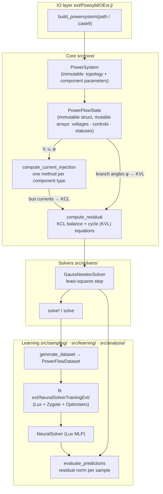

# ResidualPowerFlow.jl

Julia package for AC power flow via **residual minimisation (RPF)**. Rather than
enforcing the AC equations as hard constraints, RPF states power flow as a least-squares
problem: find the voltages that best satisfy Kirchhoff's laws. Stacking the per-bus
current balance (KCL) and the per-loop angle consistency (KVL) into one residual
vector `r(v, u)` — voltages `v`, controls `u` — RPF solves

$$\min_{v}\ \tfrac{1}{2} \lVert r(v, u) \rVert^2$$

At a true AC operating point the residual is zero; when the controls admit no exact
solution, the minimiser is the closest-feasible voltage vector instead of a solver
failure. That is what makes RPF suited to generating training data for learned
surrogates: **it can solve — and therefore sample — control values that do not satisfy
the power flow equations**, which is the usual case when drawing operating points at
random, and exactly the case a classical Newton-Raphson solver rejects.

Two properties follow from how the residual is built:

- **No bus-type classification.** There are no PV/PQ/slack types; generator voltage
  control enters as an Im(i)–V (reactive-current vs. voltage) sensitivity rather than a
  PV constraint, so all buses are treated uniformly.
- **No reference bus.** The state carries branch-angle differences tied together by KVL,
  not absolute angles referenced to a slack — so no reference bus is designated.

---

## Papers

**The method paper for this package:**

- J. Stiasny, J. Cremer, *Residual Power Flow for Neural Solvers*,
  [arXiv:2601.09533](https://arxiv.org/abs/2601.09533) (2026; submitted to the IEEE).
  Formulates the least-squares residual statement above and its use for
  generating neural-solver training data.

**Studies built on it:**

| Paper | Venue | Companion repository |
|-------|-------|----------------------|
| Physics-Informed Non-Dimensionalisation for Neural Solvers | PowerUp 2026 | [powerup-2026-nondimensionalisation](https://github.com/jbesty/powerup-2026-nondimensionalisation) |

Each companion repository pins a tagged release of this package, so its results
stay reproducible as the package moves on.

---

## Architecture



Extension modules are **weak dependencies** loaded only when their backing
packages are present:
- `PowsyblIOExt` activates when `Powsybl` is loaded.
- `JLD2Ext` activates when `JLD2` is loaded.
- `LuxExt` activates when `Lux` is loaded.
- `NeuralSolverTrainingExt` activates when `Lux`, `Zygote`, and `Optimisers` are all loaded.

---

## Design principles

### 1. Component dispatch

Every physical element implements exactly one method:

```julia
# Single-bus injector (generator, load, shunt)
compute_current_injection(component, voltage, controls) → [i_d, i_q]

# Branch (line or transformer)
compute_current_injection(component, v_from, v_to, branch_angle) → ([i_d,i_q], [i_d,i_q])
```

The residual and its derivative evaluations call this interface generically — adding a
new component type requires only this one method.

### 2. Immutable system, mutable state

`PowerSystem` is built once per network and never modified. It holds topology,
component parameters, and precomputed admittance matrices.

`PowerFlowState` holds a single operating point: voltage magnitudes and branch-angle
differences, controls, and component-status flags. Solvers work in-place on a state.

### 3. Variable layout

```
state.voltages = [V_1 … V_n  |  phi_1 … phi_m]
                 bus magnitudes  branch angle diffs (phi = theta_to - theta_from)
```

Angles are per-branch relative differences φ, not absolute bus angles θ — the
state never stores θ, and `convert_branch_angles_to_bus_angles` recovers them on
demand. The notation follows the paper, where φ is the branch angle and θ denotes
neural-network parameters. In the source the branch angle is named `branch_angle`;
the analytical derivative code (`jacobians_explicit.jl`, `energy_hessian.jl`)
writes it as `θ` to mirror the derivation.

### 4. Solver modes

`solve!(state, GaussNewtonSolver())` runs standard power flow at fixed controls. A
distributed-slack variant (`solve_distributed_slack!`) additionally frees chosen
controls to reach an AC-feasible point; it is used internally by the data samplers.

### 5. Unified PowerFlowSolver interface

All `PowerFlowSolver` subtypes implement a single method:

```julia
step!(state::PowerFlowState, solver) → (max_update, ...)   # single step, mutates state
```

Higher-level entry points build on `step!`:

```julia
solve!(state, solver; solver_options)           # simple iterative solve, mutates state
solve(state, solver; ...)  → (new_state, stats)  # non-mutating wrapper
```

A trained `NeuralSolver` can replace `GaussNewtonSolver` in any evaluation
without changing the calling code.

---

## Installation

```julia
using Pkg
Pkg.activate(".")
Pkg.instantiate()
```

Network loading from files requires the Powsybl extension:

```julia
using Powsybl, ResidualPowerFlow
```

---

## Quick start

### Standard power flow

```julia
using Powsybl, ResidualPowerFlow

# solve_load_flow = true runs PowSyBl's AC load flow first — see the note below.
system   = build_powersystem(:case9; K_DV = [130.0, 21.0, 13.0], solve_load_flow = true)
ps       = system.power_system
controls = controls_from_solution(system)
state    = PowerFlowState(ps, controls)   # flat-start voltages (1 p.u., 0 rad)

solver = GaussNewtonSolver()
stats  = solve!(state, solver; solver_options = SolverOptions(tolerance = 1e-8))

println(stats)                       # converged, feasible, iteration_count, residual_norm
println(voltage_magnitudes(state))   # bus voltage magnitudes (p.u.)
```

This reaches the AC solution: `feasible = true`, `‖r‖ ≈ 8e-9` in 5 iterations.

**`controls_from_solution` needs a solved network** — hence `solve_load_flow = true`
(or run `Powsybl.LoadFlow.run_ac` on the network yourself first). Without it the
built-in cases fall back to setpoints, and RPF then does exactly what it is for:
it minimises the residual for controls that admit no exact solution, returning a
stationary point with `feasible = false` and `‖r‖ ≈ 7e-4` rather than failing.
Freeing controls as slack variables closes that gap — `solve_distributed_slack!`
on the same setpoints reaches `‖r‖ ≈ 1e-14`.

### Dataset generation and neural training

```julia
# The prior-centred balanced sampler constructs each operating condition at the
# power-balance manifold (two line-parameter priors via a DC-flow pass), pushes
# it a controlled distance into infeasibility (offset dials), solves it with the
# GN solver, and keeps it only if it is stationarity-converged and inside the
# asymmetric residual/voltage band. The load range auto-calibrates to the
# system's carrying capacity. Defaults reproduce the tuned case9 recipe.
sampler = SamplerConfig()              # or override any universal knob
dataset = generate_dataset(ps, sampler, 1000; rng = MersenneTwister(1234))
save_dataset("data.jld2", dataset)

# Requires: using Lux, Zygote, Optimisers, ResidualPowerFlow
# The non-dimensionalisation is chosen per side: :identity, :standardised, or
# :physics_informed (input/output transforms from the Hessian of ½‖r‖² —
# the paper's contribution; defaults are standardised controls + physics voltages).
transformation = fit_data_transformation(dataset, ps;
    controls_scheme = :physics_informed, voltages_scheme = :physics_informed)
neural = NeuralSolver(transformation; n_hidden_layers = 2, n_neurons = 64)
fit!(neural, dataset, AdamTraining())

results = evaluate_predictions(neural, dataset)  # residual norm per sample
save_solver("model.jld2", neural)                # portable; load_solver needs Lux
```

### Accessing extension-defined types

The training-config constructors `AdamTraining` and `LBFGSTraining` are
re-exported from the host module via parent-module stubs: loading
`Lux`, `Zygote`, `Optimisers` populates the stubs, so

```julia
using Lux, Zygote, Optimisers
using ResidualPowerFlow
fit!(solver, dataset, LBFGSTraining(max_iterations = 1000))
```

works with bare names — same for `AdamTraining`, `fit!`, and
`fit_data_transformation`.

`TrainingDiagnostics` and `MLPArchitecture` are not currently re-exported.
Scripts that need to dispatch on them reach in via `Base.get_extension`:

```julia
const _LuxExt = Base.get_extension(ResidualPowerFlow, :LuxExt)
const MLPArchitecture = _LuxExt.MLPArchitecture
```

---

## TOML-configured datasets and training

For reproducible studies, a dataset is described declaratively in a TOML file
(`[system]`, `[dataset]`, `[sampler]` — see `configs/case9_example.toml`) and the JLD2
extension implements an artifact contract around it:

```julia
config = load_dataset_config("configs/case9_example.toml")
save_config_dataset(config)               # generate + save train/test artifacts
train = load_train_dataset(config)
test  = load_test_dataset(config)
```

`dataset_is_current(config)` digests the *resolved* sampling semantics (system, seeds,
counts, every active sampler knob), so artifacts regenerate only when the config
meaningfully changed. Two sampler strategies are registered: `balanced`
(`SamplerConfig`, default — prior-centred, auto-calibrating) and `feasible`
(`FeasibleSamplerConfig` — slack-closed AC-feasible points, `‖r‖ → 0`).

Training schedules are TOML-drivable too: `parse_training(dict)` builds a single
phase, a multi-phase schedule, or a best-of selection over candidate schedules
(`kind = "best_of"`, selected by validation loss); `fit!` accepts any of them.
`training_log` / `write_training_log_csv` export a fitted solver's per-iteration
loss curve alongside its residual curve (logged as `rho` rows holding the median
ρ = ½‖r‖², on a subsampled schedule).

---

## Primary entry points

| Symbol | Description |
|--------|-------------|
| `build_powersystem(:case9; K_DV, solve_load_flow)` | Load a built-in IEEE case (`:case9`, `:case14`, `:case30`, `:case57`, `:case118`, `:case300`). Requires Powsybl. Set `solve_load_flow = true` to run the AC load flow first. |
| `build_powersystem(path; K_DV, solve_load_flow)` | Load any Powsybl-supported file (MATPOWER `.m`, IIDM, CGMES, …). |
| `controls_from_solution(system)` | Extract the RPF control vector from the network's operating point. Requires a load-flow-solved network. |
| `PowerFlowState(ps, controls)` | Create a state with flat-start voltages. |
| `GaussNewtonSolver()` | The iterative RPF solver (fieldless algorithm tag). |
| `solve!(state, solver; solver_options)` | Simple solve, in-place. Returns a stats dict with `converged` (stationarity — the step vanished), `feasible` (‖r‖ within tolerance, i.e. an actual AC solution), `iteration_count`, `residual_norm`. |
| `solve(state, solver; …)` | Non-mutating version of the simple solve — returns `(new_state, stats)`. |
| `solve_distributed_slack!(state, free_indices; …)` | Free the given controls as a distributed slack and drive `‖r‖ → 0` (in-place; `solve_distributed_slack` is the non-mutating form). Returns a stats dict. |
| `SolverOptions(; max_iterations, tolerance, verbose)` | Convergence and step-size settings. |
| `SamplerConfig(; …)` | Universal knob block for the balanced operating-condition sampler (defaults = tuned case9 recipe). |
| `generate_dataset(ps, sampler, n; rng)` | Generate N balanced, stationarity-filtered operating points via the prior-centred sampler. |
| `calibrate_capacity(ps, sampler; rng)` | Resolve the system's load carrying capacity (bracket-then-bisect accept-fraction scan). |
| `compute_energy(state)` | The objective value ρ = ½‖r‖². Evaluations report the residual norm ‖r‖ = √(2ρ). |
| `fit_data_transformation(dataset, ps; controls_scheme, voltages_scheme)` | Fit the affine non-dimensionalisation (`:identity` / `:standardised` / `:physics_informed` per side). |
| `NeuralSolver(transformation; n_hidden_layers, n_neurons)` | Construct an untrained neural surrogate. |
| `fit!(solver, dataset, training)` | Train; `training` is `AdamTraining()`, `LBFGSTraining()`, a phase list, or `parse_training(dict)` output. |
| `evaluate_predictions(model, dataset)` | Residual norm per sample for a trained model — returns `(; energy, residual_norm)`. |
| `save_dataset` / `load_dataset`, `save_solver` / `load_solver` | JLD2 artifact IO (datasets and portable trained solvers). |
| `load_dataset_config(path)`, `save_config_dataset(config)`, `load_train_dataset(config)` / `load_test_dataset(config)` | The TOML-config artifact contract (see above). |

`K_DV` is a voltage-droop gain for `SynchronousMachineStatic` components — RPF-specific,
absent from all standard network file formats. A scalar applies the same value to all
generators; a vector gives one value per generator.

---

## Repo structure

```
src/
  core/           types, PowerSystem builder, component physics, residuals, derivatives
  solvers/        GaussNewtonSolver, distributed slack, solve API
  sampling/       operating-condition samplers (balanced, feasible) + strategy seam
  dataset/        PowerFlowDataset, TOML config contract, digests and provenance
  learning/       normalisation / non-dimensionalisation, NeuralSolver
  analysis/       dataset distribution statistics, prediction evaluation
ext/
  PowsyblIOExt.jl              network loading (weak dep on Powsybl)
  JLD2Ext.jl                   dataset save/load (weak dep on JLD2)
  LuxExt.jl                    NeuralSolver construction (weak dep on Lux)
  NeuralSolverTrainingExt/     fit! for NeuralSolver (weak dep on Lux + Zygote + Optimisers)
configs/
  case9_example.toml  example dataset config for the TOML artifact contract
examples/
  case9_pf.jl                    AC power flow
  case9_topology.jl              voltage comparison before/after a line removal
```

The built-in IEEE cases (`build_powersystem(:case9)` … `:case300`) come from
PowSyBl's bundled networks — no local data files are involved.

---

## Running the examples

```bash
julia --project examples/case9_pf.jl         # AC power flow
julia --project examples/case9_topology.jl   # topology change comparison
```

## Running the tests

```bash
julia --project -e "using Pkg; Pkg.test()"
```

## AI usage disclosure

Significant parts of this package were written with AI assistance (Anthropic's
Claude, used through Claude Code), directed and reviewed by the author. The
formulation, the numerical methodology, and the validation of results are the
author's.
