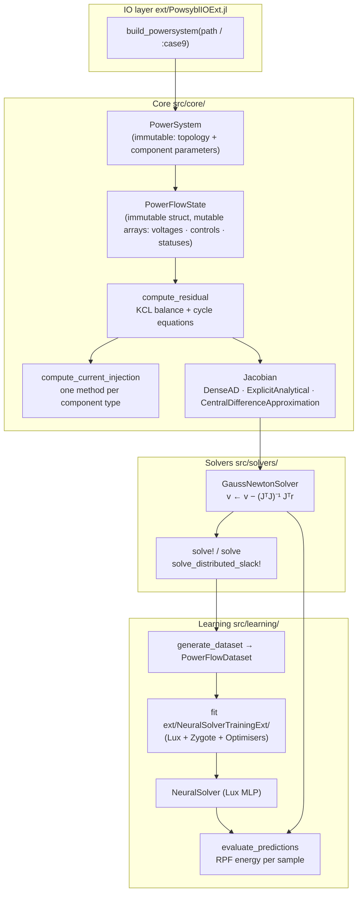

# ResidualPowerFlow.jl

Julia package for AC power flow via **residual minimisation (RPF)**: a Gauss-Newton
solver that minimises a KCL current-balance residual rather than enforcing AC feasibility
as a hard constraint. This enables solving infeasible operating points, making RPF
well-suited to generating training data for learned surrogate models — including
operating points a classical solver would reject.

**Paper:** [arxiv 2601.09533](https://arxiv.org/abs/2601.09533)

---

## How RPF differs from classical power flow

Classical Newton-Raphson power flow only converges when the operating point is
AC-feasible and the initial iterate is close enough. RPF instead minimises the sum
of squared KCL current-balance residuals across all buses using Gauss-Newton. At a
true AC solution the residual is zero; at an infeasible point it is small but nonzero.
This single change unlocks three capabilities:

- **Infeasible solves** — controls that violate AC feasibility still produce a
  well-defined "closest-feasible" voltage vector.
- **Distributed-slack feasibility** — generator-P setpoints can be freed as a
  distributed slack and driven to an AC-feasible operating point via joint
  Gauss–Newton (`solve_distributed_slack!`).
- **Surrogate training** — a `(controls → voltages)` dataset can be generated even
  for operating points that a classical solver would reject.

---

## Architecture



Extension modules are **weak dependencies** loaded only when their backing
packages are present:
- `PowsyblIOExt` activates when `Powsybl` is loaded.
- `JLD2Ext` activates when `JLD2` is loaded.
- `LuxExt` activates when `Lux` is loaded.
- `NeuralSolverTrainingExt` activates when `Lux`, `Zygote`, and `Optimisers` are all loaded.

---

## Design principles

### 1. Component dispatch

Every physical element implements exactly one method:

```julia
# Single-bus injector (generator, load, shunt)
compute_current_injection(component, voltage, controls) → [i_d, i_q]

# Branch (line or transformer)
compute_current_injection(component, v_from, v_to, θ) → ([i_d,i_q], [i_d,i_q])
```

The residual and all Jacobian methods call this interface generically — adding a new
component type requires only this one method.

### 2. Immutable system, mutable state

`PowerSystem` is built once per network and never modified. It holds topology,
component parameters, and precomputed admittance matrices.

`PowerFlowState` holds a single operating point: voltage magnitudes and branch-angle
differences, controls, and component-status flags. Solvers work in-place on a state.

### 3. Variable layout

```
state.voltages = [V₁ … Vₙ  |  θ₁ … θₘ]
                 bus magnitudes  branch angle diffs (θ_to − θ_from)
```

Angles are per-branch relative differences, not absolute bus angles.
`convert_branch_angles_to_bus_angles` converts when needed.

### 4. Solver modes

| Entry point | Mode |
|---|---|
| `solve!(state, GaussNewtonSolver())` | Fixed controls — standard power flow |
| `solve_distributed_slack!(state, free_indices)` | Free the given controls (the generator-P slack) and drive `‖r‖ → 0` by joint Gauss–Newton on `[variables; free controls]` — the AC-feasibility close used by the data samplers |

### 5. Unified PowerFlowSolver interface

All `PowerFlowSolver` subtypes implement a single method:

```julia
step!(state::PowerFlowState, solver) → (max_update, ...)   # single step, mutates state
```

Higher-level entry points build on `step!`:

```julia
solve!(state, solver; solver_options)                       # simple iterative solve, mutates state
solve(state, solver; ...)  → (new_state, stats)             # non-mutating wrapper

solve_distributed_slack!(state, free_indices; tol, max_iterations)        # distributed-slack feasibility close
solve_distributed_slack(state, free_indices; ...) → (new_state, stats)    # non-mutating wrapper
```

A trained `NeuralSolver` can replace `GaussNewtonSolver` in any evaluation
without changing the calling code.

### 6. Jacobian methods

Three implementations, all cross-verified against `CentralDifferenceApproximation`:

| Method | Notes |
|---|---|
| `ExplicitAnalytical` (default) | Hand-coded per-component derivatives |
| `DenseAD` | ForwardDiff dense; simple and correct; practical up to ~50 buses |
| `CentralDifferenceApproximation` | Central finite differences; reference only |

---

## Installation

```julia
using Pkg
Pkg.activate(".")
Pkg.instantiate()
```

Network loading from files requires the Powsybl extension:

```julia
using Powsybl, ResidualPowerFlow
```

---

## Quick start

### Standard power flow

```julia
using Powsybl, ResidualPowerFlow

sys      = build_powersystem(:case9; K_DV = [130.0, 21.0, 13.0])
ps       = sys.power_system
controls = controls_from_solution(sys)
state    = PowerFlowState(ps, controls)   # flat-start voltages (1 p.u., 0 rad)

solver = GaussNewtonSolver()
stats  = solve!(state, solver; solver_options = SolverOptions(tolerance = 1e-8))

println(stats)                       # converged, iteration_count, residual_norm
println(voltage_magnitudes(state))   # bus voltage magnitudes (p.u.)
```

### Distributed-slack feasibility close

```julia
# Free the generator-P controls as a distributed slack and drive the operating
# point to AC feasibility (‖r‖ → 0). This is the close the data samplers use.
gen_P = control_indices(ps, SynchronousMachineStatic, :P)
stats = solve_distributed_slack!(state, gen_P; tol = 1e-8, max_iterations = 100)
```

### Dataset generation and neural training

```julia
# The prior-centred balanced sampler constructs each operating condition at the
# power-balance manifold (two line-parameter priors via a DC-flow pass), pushes
# it a controlled distance into infeasibility (offset dials), solves it with the
# GN solver, and keeps it only if it is stationarity-converged and inside the
# asymmetric residual/voltage band. The load range auto-calibrates to the
# system's carrying capacity. Defaults reproduce the tuned case9 recipe.
sampler = SamplerConfig()              # or override any universal knob
dataset = generate_dataset(ps, sampler, 1000; rng = MersenneTwister(1234))
save_dataset("data.jld2", dataset)

# Requires: using Lux, Zygote, Optimisers, ResidualPowerFlow
transformation = fit_data_transformation(dataset, ps)
neural = NeuralSolver(transformation; n_hidden_layers = 2, n_neurons = 64)
fit!(neural, dataset, AdamTraining())

results = evaluate_predictions(neural, dataset)  # RPF energy per sample
```

### Accessing extension-defined types

The training-config constructors `AdamTraining` and `LBFGSTraining` are
re-exported from the host module via parent-module stubs: loading
`Lux`, `Zygote`, `Optimisers` populates the stubs, so

```julia
using Lux, Zygote, Optimisers
using ResidualPowerFlow
fit!(solver, dataset, LBFGSTraining(max_iterations = 1000))
```

works with bare names — same for `AdamTraining`, `fit!`, `diagnose`, and
`fit_data_transformation`.

`TrainingDiagnostics` and `MLPArchitecture` are not currently re-exported.
Scripts that need to dispatch on them reach in via `Base.get_extension`:

```julia
const _LuxExt = Base.get_extension(ResidualPowerFlow, :LuxExt)
const MLPArchitecture = _LuxExt.MLPArchitecture
```

---

## Primary entry points

| Symbol | Description |
|--------|-------------|
| `build_powersystem(:case9; K_DV)` | Load a built-in IEEE case (`:case9`, `:case14`, `:case57`, `:case118`). Requires Powsybl. |
| `build_powersystem(path; K_DV)` | Load any Powsybl-supported file (MATPOWER `.m`, IIDM, CGMES, …). |
| `controls_from_solution(sys)` | Extract the RPF control vector from the network's operating point. |
| `PowerFlowState(ps, controls)` | Create a state with flat-start voltages. |
| `GaussNewtonSolver()` | The iterative RPF solver (fieldless algorithm tag). |
| `solve!(state, solver; solver_options)` | Simple solve, in-place. Returns a stats dict with `converged`, `iteration_count`, `residual_norm`. |
| `solve(state, solver; …)` | Non-mutating version of the simple solve — returns `(new_state, stats)`. |
| `solve_distributed_slack!(state, free_indices; weights, tol, max_iterations)` | Free the given controls as a distributed slack and drive `‖r‖ → 0`. Returns a stats dict. |
| `solve_distributed_slack(state, free_indices; …)` | Non-mutating version — returns `(new_state, stats)`. |
| `SolverOptions(; max_iterations, tolerance, verbose, jacobian_method)` | Convergence and step-size settings. |
| `SamplerConfig(; …)` | Universal knob block for the balanced operating-condition sampler (defaults = tuned case9 recipe). |
| `generate_dataset(ps, sampler, n; rng)` | Generate N balanced, stationarity-filtered operating points via the prior-centred sampler. |
| `calibrate_capacity(ps, sampler; rng)` | Resolve the system's load carrying capacity (bracket-then-bisect accept-fraction scan). |
| `NeuralSolver(transformation; n_hidden_layers, n_neurons)` | Construct an untrained neural surrogate. |
| `evaluate_predictions(model, dataset)` | Compute RPF energy per sample for a trained model. |

`K_DV` is a voltage-droop gain for `SynchronousMachineStatic` components — RPF-specific,
absent from all standard network file formats. A scalar applies the same value to all
generators; a vector gives one value per generator.

---

## Repo structure

```
src/
  core/           types, PowerSystem builder, component physics, residuals, Jacobians
  solvers/        GaussNewtonSolver, distributed-slack feasibility close, solve API
  learning/       dataset generation, normalisation, NeuralSolver, evaluation
ext/
  PowsyblIOExt.jl              network loading (weak dep on Powsybl)
  JLD2Ext.jl                   dataset save/load (weak dep on JLD2)
  LuxExt.jl                    NeuralSolver construction (weak dep on Lux)
  NeuralSolverTrainingExt/     fit!/diagnose for NeuralSolver (weak dep on Lux + Zygote + Optimisers)
examples/
  case9_pf.jl                    AC power flow
  case9_topology.jl              voltage comparison before/after a line removal
data/
  matpower/       MATPOWER .m files for built-in IEEE cases
test/
  data/iidm/      IIDM test fixtures
```

---

## Running the examples

```bash
julia --project examples/case9_pf.jl         # AC power flow
julia --project examples/case9_topology.jl   # topology change comparison
```

## Running the tests

```bash
julia --project -e "using Pkg; Pkg.test()"
```
